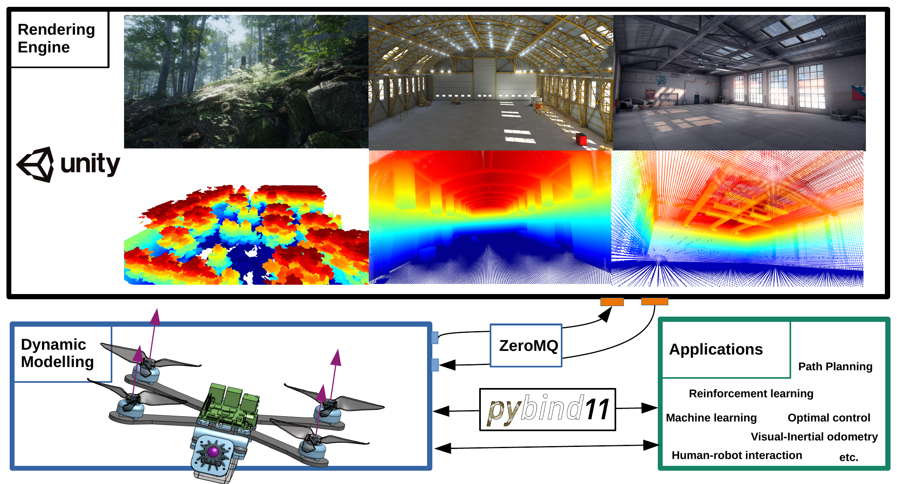

# Introduction

Flightmare is an open-source simulator for quadrotors. It is composed of two main components: a configurable rendering engine built on Unity and a flexible physics engine for dynamics simulation. In addition, it has OpenAI gym-style python wrapper for reinforcement learning tasks and flexible interface with stable baselines for solving these tasks with deep RL algorithms. Flightmare provides ROS wrapper to interface with popular ROS packages, such as [high_mpc](https://github.com/uzh-rpg/high_mpc) for learning-based mpc, [rpg_mpc](https://github.com/uzh-rpg/rpg_mpc) for advanced quadrotor controller, and [rpg_quadrotor_control](https://github.com/uzh-rpg/rpg_quadrotor_control) for hard-ware-in-the-loop simulation.

# Software Components
- [flightlib](../flightlib/): Flightmare Library
    - Quadrotor Dynamics
    - Sensors Simulation
    - Unity Bridge
    - Python Wrapper
- [flightrender](../flightrender/): Flightmare Rendering Engine
    - Photo-realistic 3D Environment
    - RGB Images, Depth, Segmentation
- [flightrl](../flightrl/): Reinforcement Learning Algorithms and Examples
    - Deep Reinforcement Learning Algorithms, e.g., PPO
    - Reinforcement learning examples, e.g., quadrotor control
- [flightros](../flightros/): ROS Wrapper for Flightmare Library
    - ROS wrapper
    - Quadrotor Control example with PID controller, also simulate RGB Camera that can request images from Flightmare Rendering Engine.

[Back to Main](wiki_home.md)